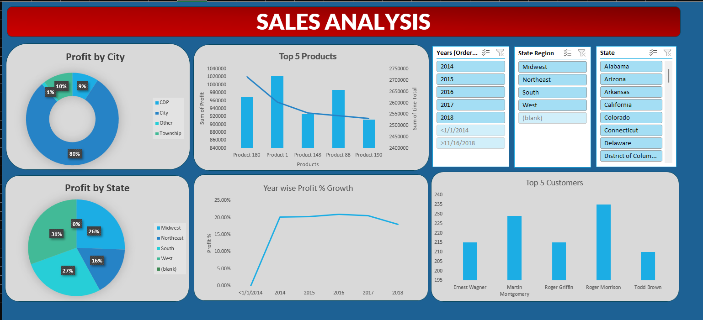

# 📊 Sales Dashboard (Excel)

## 📌 Project Overview
This Excel-based dashboard analyzes product performance and profitability. Built using formulas like VLOOKUP, SUMIFS, and PivotTables, it provides actionable insights through interactive filters.

## 🛠️ Tools & Features
- Microsoft Excel
- VLOOKUP, SUMIFS, Named Ranges
- PivotTables, Pivot Charts
- Slicers for Year, Region, State

## 📈 Key Insights
- 🔝 Top 5 Products
- 🏙️ Profit by City and State
- 📆 Year-wise Sales Growth
- 🙋‍♂️ Top 5 Customers (with Slicers)

## 📁 Files Included
- `Dynamic_Excel_Dashboard.xlsx` – Interactive Excel dashboard
- `screenshots/dashboard.png` – Visual preview of the dashboard

## 🗂️ Dataset Source
Sample dataset sourced from [Kaggle](https://www.kaggle.com/)

## 📷 Dashboard Preview

